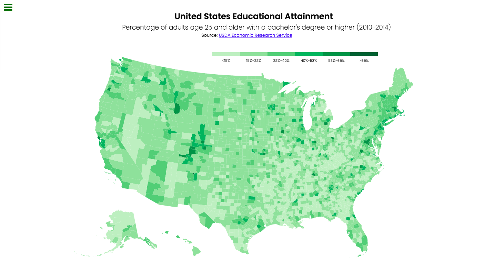

# D3.js Percentage of Adults with Bachelor's Degree Choropleth Map

This project was created as part of the freeCodeCamp Data Visualization [Certification](https://www.freecodecamp.org/learn/data-visualization). 

The objective of the project is to build a choropleth map that shows the percentage of adults age 25 and older with a bachelor's degree or higher (2010-2014) using the [D3.js](https://d3js.org/) library.

## Dependencies

This code relies on the following external libraries:

• [d3.js v6.7.0](https://d3js.org/d3.v6.min.js)
 
• [topojson v3.0.2](https://cdnjs.cloudflare.com/ajax/libs/topojson/3.0.2/topojson.min.js)
 

Both libraries are loaded using a CDN link in the HTML file.

## Data Sources

The choropleth map uses two datasets from freeCodeCamp:

- [counties.json](https://cdn.freecodecamp.org/testable-projects-fcc/data/choropleth_map/for_user_education.json) containing the county boundaries of the United States in the TopoJSON format.
 
- [for_user_education.json](https://cdn.freecodecamp.org/testable-projects-fcc/data/choropleth_map/counties.json) containing the educational attainment data of US counties in JSON format.

## Screenshot

Here is an example of what the choropleth map looks like when you run the code:
 

## Project Structure
The project is a single HTML file (index.html) with the following JavaScript code:

- Load the data files using d3.json.
- Create a SVG element to display the map.
- Create a color scale using d3.scaleThreshold.
- Create a tooltip.
- Create a legend using d3.selectAll.
- Use topojson.feature method to convert the county data to GeoJSON format.
- Use d3.selectAll and .data to bind the data to the SVG and create the path elements.
- Set the fill color of each county based on the percentage of adults aged 25 and older with a bachelor's degree or higher.
- Create interactivity with the tooltip on hover.

## Credits

This code was developed by me and was based on the examples and instructions provided by the [freeCodeCamp](https://www.freecodecamp.org/) platform.